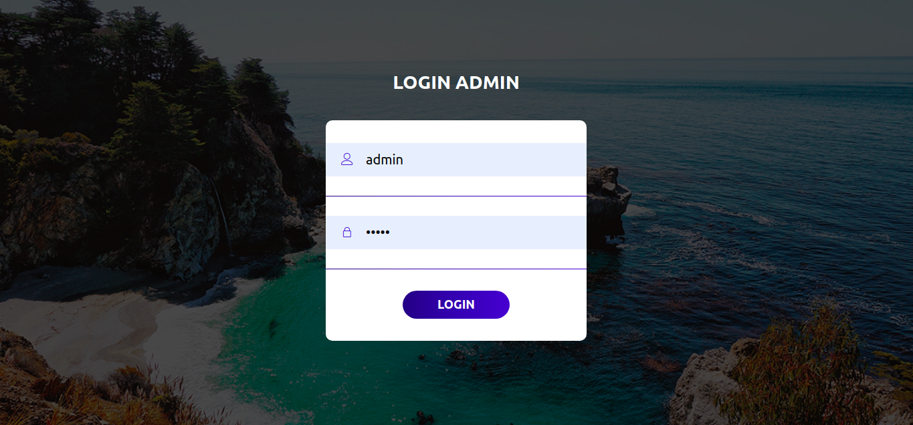
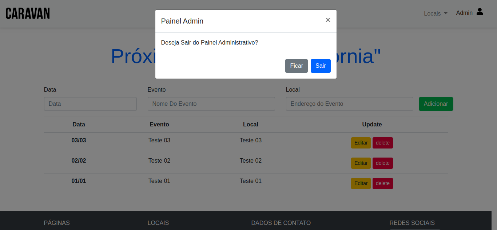
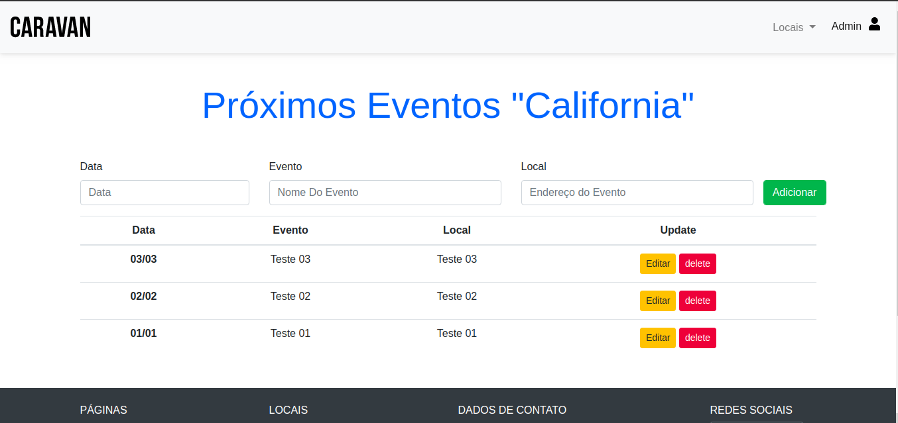
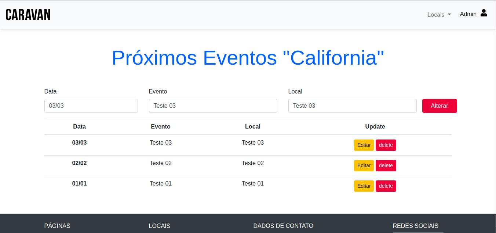

<h1 align="center">Aplicação Web - Projeto PHP</h1>

<h2><b>Critérios do trabalho:</b></h2>

1. **Avaliação:**
- [x] Integração com Banco de Dados;
- [x] Ser desenvolvido em PHP;
- [x] Interface agradavel;
- [x] Possuir contole de sessão;
- [x] Possuir tela de login;
- [x] Realizar CRUD (Create, Read, Update, Delete) via interface;
- [x] <b><i>Nota EXTRA:</i></b> Fazer integração com banco de Dados em nuvem.

<h2><b>Descrição do Projeto</b></h2>

1. **Template**
   * O projeto foi feito em sobre uma template desenvolvida por mim em um curso da plataforma _Origamid_;
   * A template consiste em um site de Turismo e Organização de Eventos;
   * Foi criado como adcional uma tela de login e pagina de adminitrador onde se encontra o CRUD.
   * Algumas partes da templates são apenas **Ilustrativas**
2. **PHP e Sql**
   * O projeto é feito em ambiente local (_localhost ou 127.0.0.1_);
   * Com PHP consegui  dar novas funcionalidades ao projeto utilizando PHP estruturado, controle de Sessão e interação da linguagem com o Banco de Dados;
   * **CRUD -** consiste em 4 tabelas, as tabelas de "Cidades" foram implemtadas as funções de criar, visualizar, editar e deletar, na tabela "Admin" onde se encontra o login e a senha da pagina administrativa.
   * **Login -** a tela é de acesso apenas adminitrativo portanto tendo apenas um usuario com o login e senha(Criptografada com MD5 ).

<h2>Clonando e Exucutando o Projeto em sua Maquina</h2>
<h3>Requisitos:<h3>

* Ter instalado a versão 7 do PHP;
* Possuir intalado na maquina o Apache e o Mysql;

Clonando o projeto em sua maquina.

<code>git clone https://github.com/williancae/aplicacao_Web.git</code>

Importe o Banco <i>caravan.sql</i> que esta pasta "bancoDeDados", e  abra com seu Phpmyadmin.

<h2><b>Tela - Login Administrador</b></h2>
<h3 ><b>Login</b></h3>

1. Para chegar a esta pagina é nescessario inserir na URL o comando <code>/admin.php</code> colando logo após a <code>localhost/aplicacao_Web</code>, tendo como resultado <code>localhost/aplicacao_Web/admin.php</code> 
2. Feito isso voce será direcionado a essa tela de login exibida acima, para fazer login é nescessarios preencher os campos com <strong>Login:</strong> admin e <strong>Senha:</strong> admin.
<h3 ><b>Logout</b></h3>

1. No Canto superior direito da tela havera a palavra "Admin" ao clicar sobre ela abrira um modal; 
2. Ao abrir o modal o você tera a opção de SAIR ou FICAR; 
3. É de extrema importancia fazer o logout ao sair para <strong>finalizar a sessão </strong>devido caso não seja  feito o logout a pagina administriva continuara aberta.

<h2>Pagina Administrativa - CRUD</h2>

Ao chegar na tela do CRUD você tera a opção de criar, editar e excluir um evento, demontrados em BUTTONS.

<h3 ><b>CREATE</b></h3>

Criando um evento. Para criar um evento clique sobre o butão verde de adicionar, e prencha os campos "Data, Evento e Local" atenção no campo "Data" coloque o dia e o mês dividos por uma Barra "/", depois de adcionado sera exibido um aviso de adicionado com sucesso.

<h3><b>UPDATE</b></h3>

Quando clicado sobre o botão editar será enviado o campo a ser editado para dentro dos campos de edição onde você poderar ser feito a edição.

<h3 ><b>DELETE</b></h3>

Ao apertar sobre o botão delete, será excluido automaticamento do banco e da lista, além de mostrar uma aviso que foi excluido com sucesso.

<h1>Integrantes</h1>
<h2>Falculdade Projeção Sobradinho - Quadra 4</h2>

<b>Nome: </b>Willian Caetano Campos &nbsp;&nbsp;&nbsp;&nbsp;&nbsp;&nbsp;<b>Curso: </b>Análise e desenvolvimento de sistema<b>&nbsp;&nbsp;&nbsp;&nbsp;&nbsp;&nbsp;&nbsp;&nbsp;Matricula: </b>201811018

<h2>Linkedin:<a href="https://www.linkedin.com/in/willian-caetano-670546185/" target="_blank"> Willian Caetano</a>&nbsp;&nbsp;&nbsp;&nbsp;&nbsp;&nbsp;&nbsp;&nbsp;&nbsp;&nbsp;&nbsp;&nbsp;&nbsp;&nbsp;&nbsp;&nbsp;&nbsp;&nbsp;&nbsp;&nbsp;&nbsp;GitHub: <a href="https://github.com/williancae" target="_blank"> WillianCae</a></h2>
